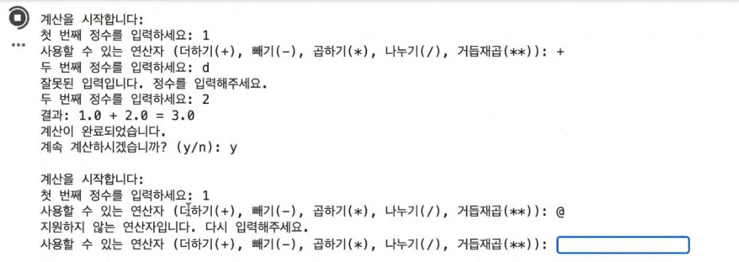
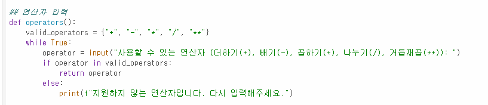
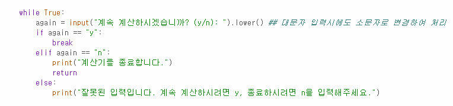

# AIFFEL Campus Online Code Peer Review Templete
- 코더 : 양건우
- 리뷰어 : 이은솔


# PRT(Peer Review Template)
- [x]  **1. 주어진 문제를 해결하는 완성된 코드가 제출되었나요?**
    - 문제에서 요구하는 최종 결과물이 첨부되었습니다.
    - 입력한 값이 정수가 아닌 경우 오류 메시지를 출력하며, 정수가 입력될 때까지 다시 입력받기를 시도합니다.
    - 지정한 연산자가 아닌 경우 적절한 오류 메시지를 출력합니다.
    - math 모듈을 사용하여 제곱 연산을 지원하고, 계속 계산을 할 것인지 입력 받는 것을 확인하였습니다.
    - 
    
- [ ]  **2. 전체 코드에서 가장 핵심적이거나 가장 복잡하고 이해하기 어려운 부분에 작성된 
주석 또는 doc string을 보고 해당 코드가 잘 이해되었나요?**
    - 제가 해결하지 못한 코드블럭이어서 핵심적인 코드로 선정하였습니다.
    - 다만 해당 코드 블럭에 doc string/annotation, 주석 코드의 작동 원리 등은 작성되어 있지 않습니다.
    - 
        
- [x]  **3. 에러가 난 부분을 디버깅하여 문제를 해결한 기록을 남겼거나
새로운 시도 또는 추가 실험을 수행해봤나요?**
    - 계산기 연속 작동여부 판단시 y 또는 n가 소문자로 입력되도록 추가 시도하였습니다.
    - 문제의 원인이나 해결한 기록은 별도로 기술되어 있지 않습니다.
    - 
        
- [ ]  **4. 회고를 잘 작성했나요?**
    - 코드 결과물에 대해 배운 점이나 아쉬운 점 등이 기술되어 있지 않습니다.
    - 다만 페어 리뷰를 하며 코드상 아쉬운 점에 대해 구두로 말씀해주셨습니다.
        
- [ ]  **5. 코드가 간결하고 효율적인가요?**
    - 코드는 범용적으로 사용할 수 있도록 함수화/모듈화 하였으나, 코드가 중복되는 지점이 다수 확인됩니다.
    - 


# 회고(참고 링크 및 코드 개선)
```
# 페어프로그래밍 그루님과 함께 해결하지 못했던 코드 블럭(연산자 관련)이 있었으나 페어리뷰를 통해 해결방법을 알 수 있었습니다. 
# 추가적으로 제가 생각지 못했던 오류 발생지점(계산기 연속 작동여부 판단시 y 또는 n이 아닌 문자열을 넣었을 때도 계산기가 종료된다는 점)을 확인할 수 있었습니다.

```